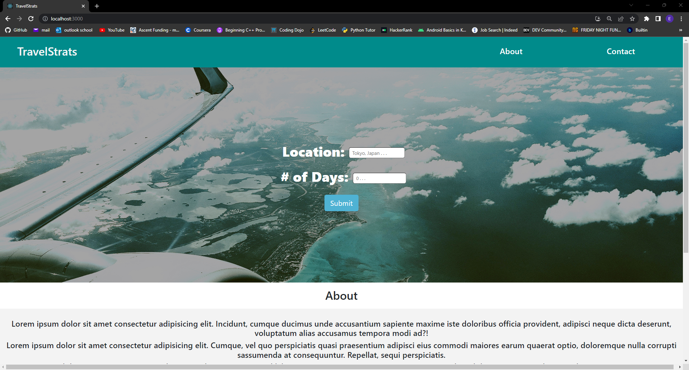
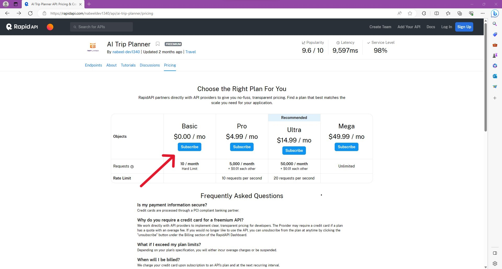
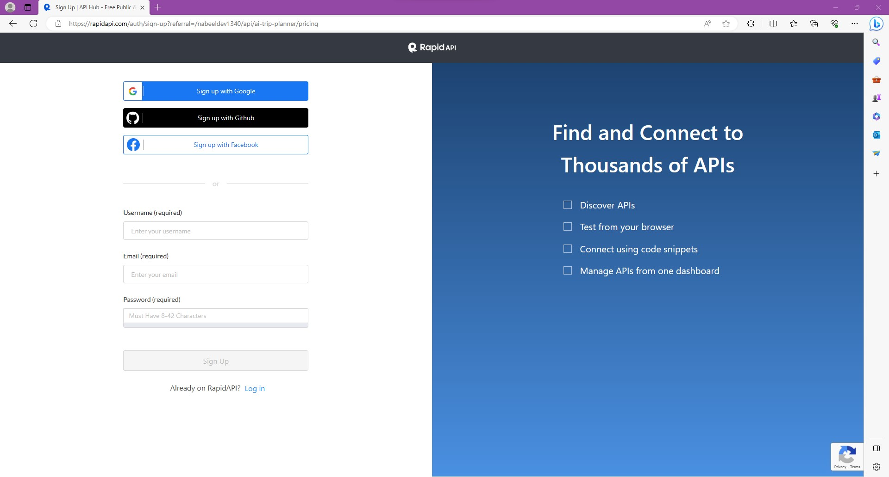
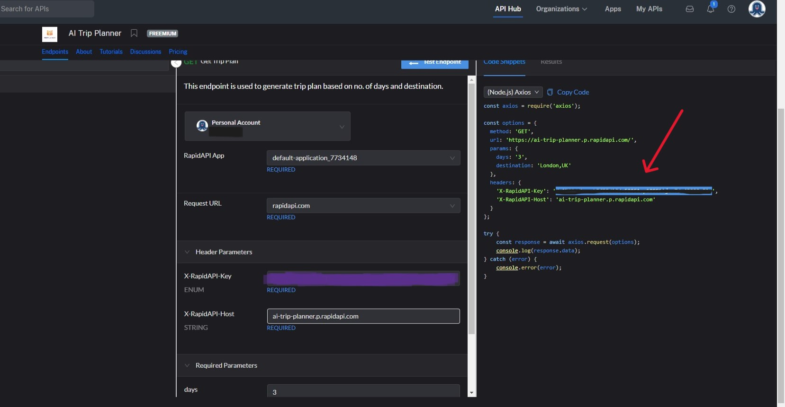
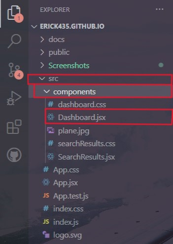
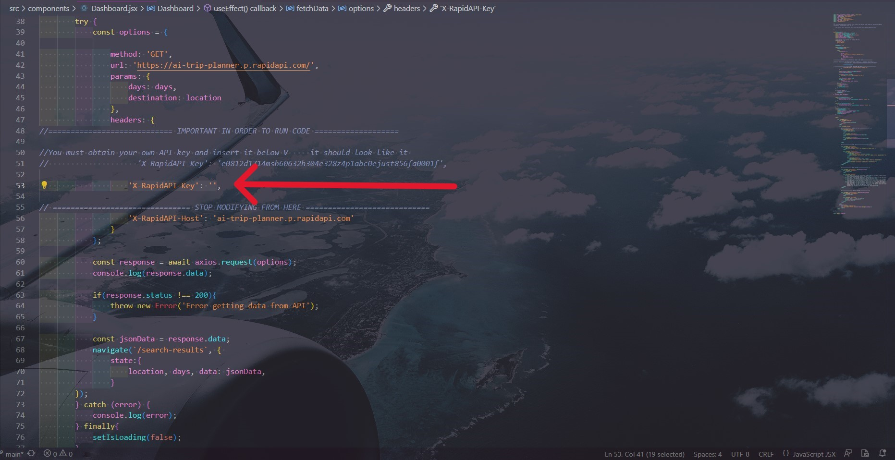
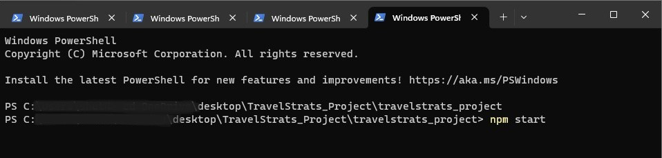

# About my Project

In order to start, you must first open you terminal/shell and open the directory in which you cloned the project and cd to the project name. 

```
C: \path\to\Travelstrats_Project> 
```

Then you will need to install a few required items needed to run the project but not to worry just copy and paste!

```
npm install react react-helmet react-router-dom axios react-spinners @emotion/react
```

Once you have everything installed, you can run the React App by typing "npm start" and this will automatically open a window screen for you.

```
TravelStrats_Project> npm start
```
If for any reason a new window does not open up automatically, then you can open a browser of your choice (preferrably Chrome) and in the url type:
>localhost:3000




In order to be able to search for the data (in this case the destination and how many days the person is staying), you must first get an API key since the API I'm using is not mine and requires to get one. 

To get started, click [Here](https://rapidapi.com/nabeeldev1340/api/ai-trip-planner/)

You should be directed to this screen, and then click on "Pricing" where the red arrow is showing


It should direct you to another screen where you will be asked which subscription you would like to have. Click on the subscribe button under "Basic"



* Just a quick reminder, with this package, you will only have 10 calls per account (you can only search/run the project 10x)



Once you have created you account, head back to the [AI Trip Planner Api](https://rapidapi.com/nabeeldev1340/api/ai-trip-planner/). You should be able to see your API key now, you can copy the key, from the right side. 



Great! Now you have your API key, all you need to do now is just add that key to the Dashboard.jsx file. Which I will show you just in case. 

I have the project running on VSCode so my files may or may not look a little bit different from your machine. When cloning and opening the project, to navigate to the Dashboard.jsx file, I highlight the folders/files we need to go to in order to find it.

>src -> components -> Dashboard.jsx



Once we open the code, we have to find the line where we need add our API key located at 

> X-RapidAPI-Key': ''



Save the project and open your terminal or your cmd and navigate to the project.



This will open up a new Window and you have now successfully started the server and React application 

# Getting Started with Create React App

This project was bootstrapped with [Create React App](https://github.com/facebook/create-react-app).

## Available Scripts

In the project directory, you can run:
### `npm start`

Runs the app in the development mode.\
Open [http://localhost:3000](http://localhost:3000) to view it in your browser.

The page will reload when you make changes.\
You may also see any lint errors in the console.

### `npm test`

Launches the test runner in the interactive watch mode.\
See the section about [running tests](https://facebook.github.io/create-react-app/docs/running-tests) for more information.

### `npm run build`

Builds the app for production to the `build` folder.\
It correctly bundles React in production mode and optimizes the build for the best performance.

The build is minified and the filenames include the hashes.\
Your app is ready to be deployed!

See the section about [deployment](https://facebook.github.io/create-react-app/docs/deployment) for more information.

### `npm run eject`

**Note: this is a one-way operation. Once you `eject`, you can't go back!**

If you aren't satisfied with the build tool and configuration choices, you can `eject` at any time. This command will remove the single build dependency from your project.

Instead, it will copy all the configuration files and the transitive dependencies (webpack, Babel, ESLint, etc) right into your project so you have full control over them. All of the commands except `eject` will still work, but they will point to the copied scripts so you can tweak them. At this point you're on your own.

You don't have to ever use `eject`. The curated feature set is suitable for small and middle deployments, and you shouldn't feel obligated to use this feature. However we understand that this tool wouldn't be useful if you couldn't customize it when you are ready for it.

## Learn More

You can learn more in the [Create React App documentation](https://facebook.github.io/create-react-app/docs/getting-started).

To learn React, check out the [React documentation](https://reactjs.org/).

### Code Splitting

This section has moved here: [https://facebook.github.io/create-react-app/docs/code-splitting](https://facebook.github.io/create-react-app/docs/code-splitting)

### Analyzing the Bundle Size

This section has moved here: [https://facebook.github.io/create-react-app/docs/analyzing-the-bundle-size](https://facebook.github.io/create-react-app/docs/analyzing-the-bundle-size)

### Making a Progressive Web App

This section has moved here: [https://facebook.github.io/create-react-app/docs/making-a-progressive-web-app](https://facebook.github.io/create-react-app/docs/making-a-progressive-web-app)

### Advanced Configuration

This section has moved here: [https://facebook.github.io/create-react-app/docs/advanced-configuration](https://facebook.github.io/create-react-app/docs/advanced-configuration)

### Deployment

This section has moved here: [https://facebook.github.io/create-react-app/docs/deployment](https://facebook.github.io/create-react-app/docs/deployment)

### `npm run build` fails to minify

This section has moved here: [https://facebook.github.io/create-react-app/docs/troubleshooting#npm-run-build-fails-to-minify](https://facebook.github.io/create-react-app/docs/troubleshooting#npm-run-build-fails-to-minify)
